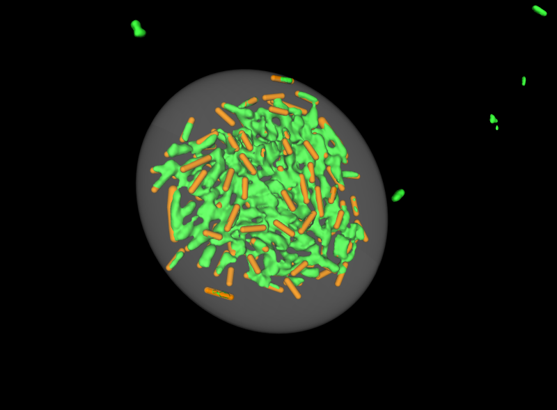
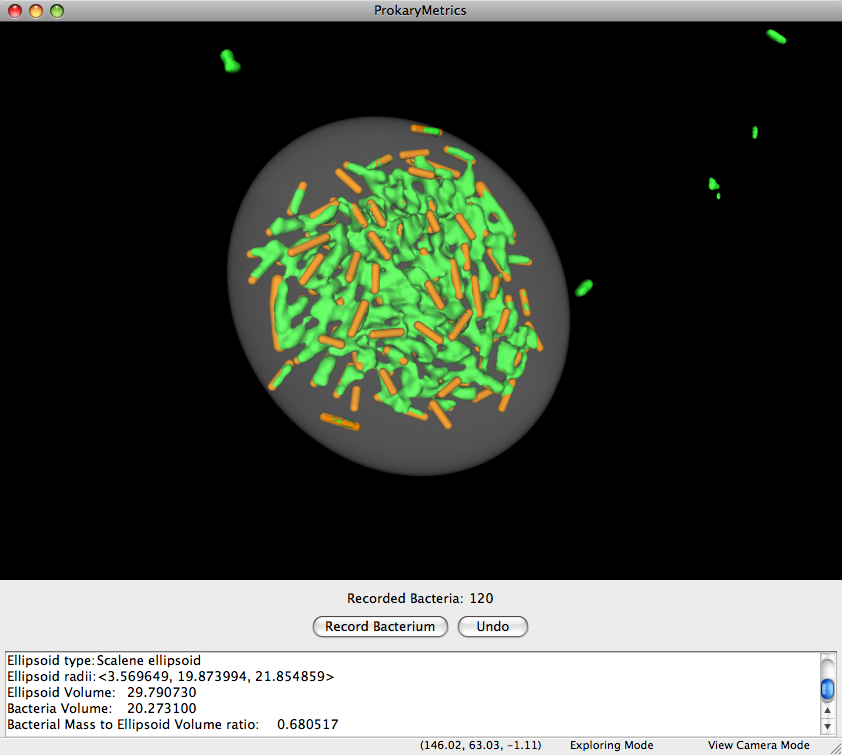
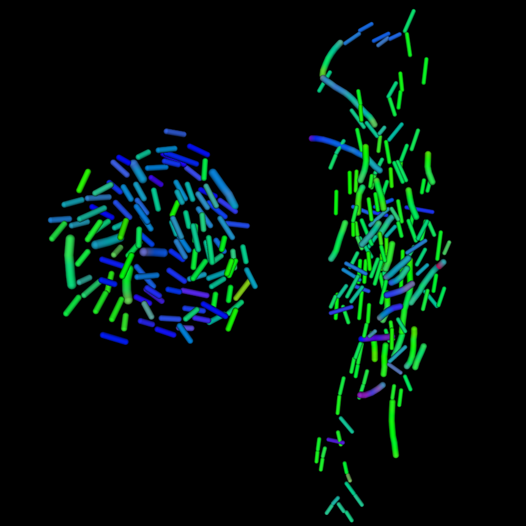

Analytics
=========
After reconstructing microscopy data, the second aim of ProkaryMetrics is 
to provide the tools for quantitative analysis of the visualized 
communities. This section provides information on each of the tools 
provided by ProkaryMetrics and how to use them.

Data Display Panel
------------------
Before describing the available quantitative analysis tools, the data 
display panel needs to be introduced. This panel (normally hidden) is a 
simple text display that ProkaryMetrics uses to provide the user with 
numerical information relating to the performed analyses. For some tools 
this information is supplementary to the visual representation of the 
results, for other tools the data display panel is the only means to 
provide the results to the user.

To access the panel on a Windows machine, hold down the Ctrl button and 
press the D key. On a Mac, hold down Command (or apple) and press the D 
key.

Quick Reference
^^^^^^^^^^^^^^^
Windows: Ctrl-D

Mac OS: Apple-D (Command-D)

Volume Estimation
-----------------
A useful method for understanding the amount of space occupied by a 
microbial community is to fit an ellipsoid (also known as a 3D ellipse, or
a generalized sphere) to the community itself. ProkaryMetrics can use 
either recorded bacteria or, if you want a quick estimation of volume, 
any markers that are placed. In that second case, just toggle into 
Recording Mode and place markers on the reconstructed data near the 
extents of the community. Note that if you are doing this, ProkaryMetrics 
will provide a better estimation if the markers are not right up against 
the edge of the data, but somewhat inward a bit.

Performing the Fit
^^^^^^^^^^^^^^^^^^
To actually perform the volume estimation, click on the Tools >> Volume 
Estimation >> Fit Ellipsoid menu option. The only requirement to using 
this tool is that you have at least nine (9) markers placed. This can 
either be actual markers (as in the second option from above) or recorded 
bacteria that required at least 9 markers to create. For example, if you 
have 3 bacilli (2 markers each) and one filament that required 3 markers, 
the recorded bacteria make up 9 markers in total. When you click the 
Record Bacterium button, ProkaryMetrics visually represents the bacterium
as the bacillus-like shapes that appear, but internally represents the 
bacterium as a set of 3D points corresponding to the markers you placed.

When you select this menu option, ProkaryMetrics performs the necessary 
calculations and then displays a mostly transparent ellipsoid surrounding 
the data:

   
The data display panel provides additional numeric information as seen 
below:

   
ProkaryMetrics provides the user with additional quantitative information 
including a broad classification of the ellipsoid type (here Scalene 
because two of the three radii are essentially equal), the numeric volume 
of the fitting as well as that of the recorded bacteria, and finally the 
ratio of the two.

Toggle visibility
^^^^^^^^^^^^^^^^^
If you want to continue marking bacteria, the rendered ellipsoid will 
interfere with the cursor tracing the surface of the rendered image data. 
So to hide the ellipsoid, select the Tools >> Volume Estimation >> Toggle 
Ellipsoid Visibility. To see it again, simply click the menu item again.

Bacteria Orientation 
---------------------
Another interesting and useful bit of quantitative data is calculating 
how the bacteria are oriented within the 3D space that they occupy. 
For each bacterium, ProkaryMetrics calculates the main axis vector and 
compares that to the X, Y, and Z axes to get a number that describes 
how much the bacterium deviates from each of the axes. Those numbers are 
then used to color the bacteria, associating Red, Green, and Blue with 
the deviations from X, Y, and Z respectively.

ProkaryMetrics provides three coloring schemes to map X/Y/Z to colors: 
RGB, GBR, and BGR. The figure above shows the BGR coloring, and gives a 
good example of the utility in comparing orientations between data sets. 
In the community on the left, the bacteria are split between those with 
the major orientation component along the X (blue) axis and the Y (green) 
axis. Whereas with the community on the left, the clear majority of 
bacteria are aligned along the Y (green) axis. Note that a few of the 
bacteria have a signficant portion of their orientation in the Z axis, and
they have a reddish component, making the bacteria either purple for those
with the other major component along the X axis, or yellow for those with 
a major component along the Y axis.

Performing the Orientation Visualization
^^^^^^^^^^^^^^^^^^^^^^^^^^^^^^^^^^^^^^^^
To color the bacteria using orientation information, as seen in the figure
above, select the Tools >> Orientation >> Color Bacteria by Orientation 
submenu, and choose one of the available coloring schemes as listed 
previously. You can return the bacteria to their original colors through 
the View >> Image Layer Settings dialog box. Additionally, the orientation
information can be exported to a CSV through the File >> Export menu.

Descriptive statistics can also be calculated for the overall orientation 
information. Select the Tools >> Orientation >> Calculate Orientation 
Stats menu item. The results are shown in the Data Display Panel and give 
the mean, median, standard deviation, and first and third quartiles.

Community Distance Information
------------------------------
The final analytic tool available is calculating the average distance 
among the community members. This calculation is meant to give a metric 
for comparing how densely packed the bacteria are within the community. 
The community distance currently has no visual aspect, but the results are
output to the Data Display Panel. To perform the calculation, select the 
Tools >> Calculate Community Distance Stats menu item. The results give 
the mean, median, standard deviation, and first and third quartiles.

