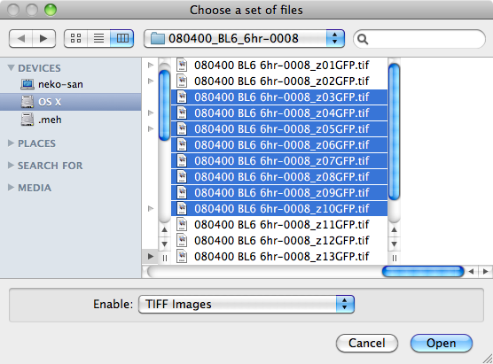

Data 
=====
ProkaryMetrics is designed to reconstruct volumetric image data by 
combining sets of 2D images known as z-stacks that represent optical 
slices of a physical data sample. Currently the default image format 
used by ProkaryMetrics is the Tagged Image File Format (TIFF), but 
the software also supports JPEG images.

Opening Files
-------------
Image data is added to the current rendering window through the 
File >> Open Image File(s)... menu item. Since a z-stack is expected, 
the file selection dialog will accept multiple file selection.

   
 Projects
 --------
 
 
 Exporting
 ---------