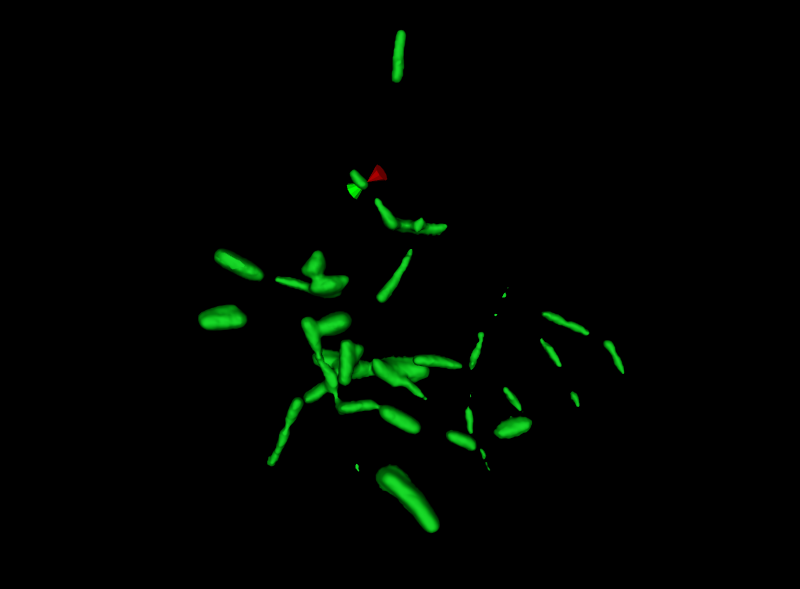
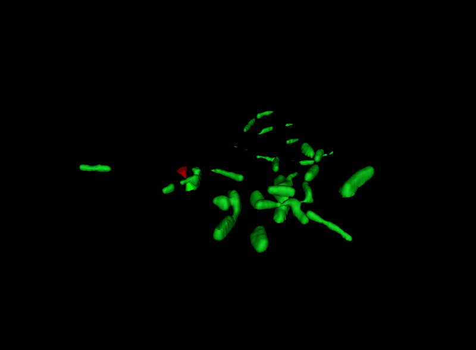
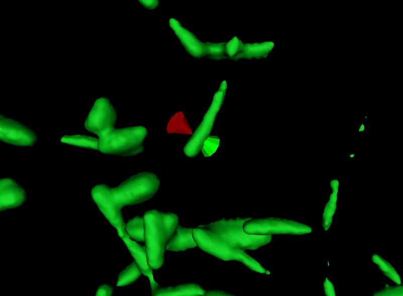
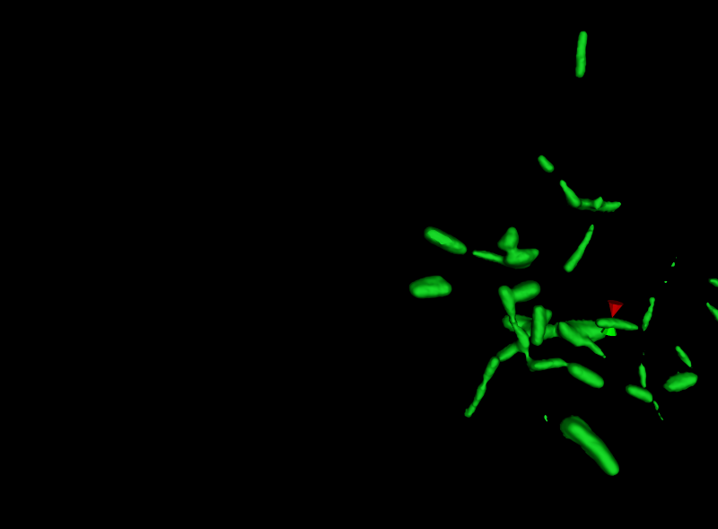
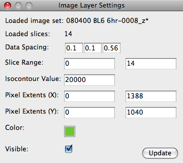
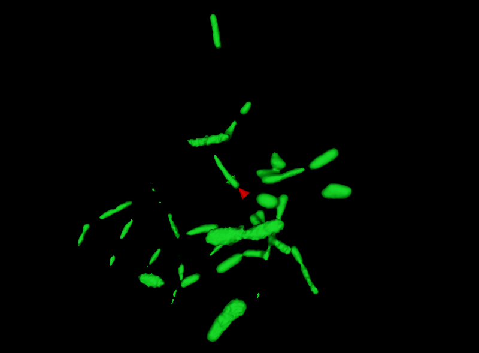
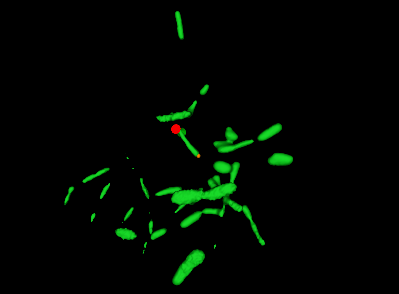
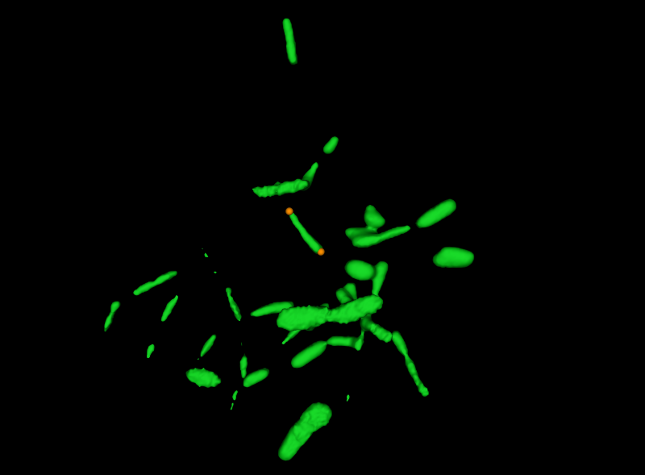
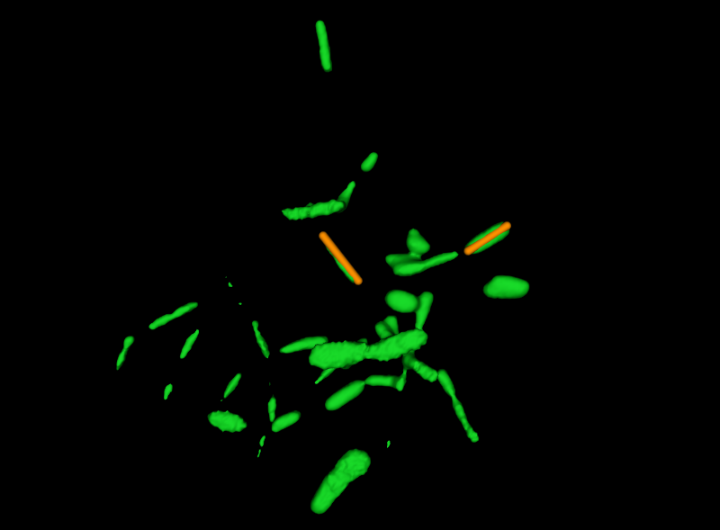
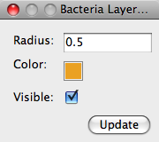

Data Interaction
================
The main purpose behind 3D rendering of microbial communities is to be 
able to interact with the data (rotating, zooming, cropping, etc...) in 
order to gain an understanding of your data that may not be possible 
through viewing 2D slices. This section describes the facilities 
ProkaryMetrics provides to allow you to explore your data.

Exploring the Rendered Image Data
---------------------------------
The mouse is the main means of interacting with rendered image data. The 
few keyboard commands available will be discussed as appropriate in this 
section. A list of all the keyboard commands is at the end of this 
section with a short description of each key's purpose.

Rotating Image Data
^^^^^^^^^^^^^^^^^^^
Imagine the the rendered image data is contained within a transparent 
hamster ball floating in space. If you grab the hamster ball, you can 
rotate it in any direction and the image data will rotate along with it. 
In ProkaryMetrics, you can use the mouse to rotate the hamster ball. 
Begin by left-clicking (and holding the mouse button down) anywhere 
within the Visualization Window. While holding the button, move the mouse 
and any data in the window will rotate in the direction you are moving 
the mouse. The first example below shows an initial rendering of a sample 
image set with the cursor near one bacterium.

   
In the next image, the data has been rotated counter-clockwise 
approximately 90 degrees, and rotated away from the user (into the 
screen) approximately 45 degrees.
   

   
Magnification
^^^^^^^^^^^^^
Zooming in and out can be accomplished either with the mouse wheel (up to 
zoom in, down to zoom out) or by right-clicking and dragging with the 
mouse. Dragging up zooms in, dragging down zooms out. Zooming with the 
mouse wheel generally results in larger magnification steps. Zooming 
with the right mouse button gives you smoother magnification and slightly 
more control over how far it zooms in and out.

This screenshot shows the original data from above, magnified.

   
Moving Data
^^^^^^^^^^^
Especially when magnifying data, in order to get the best view it is very 
useful to translocate the rendered data. In other words, moving the data 
up/down or left/right in order to center a particular section of interest 
within the Visualization Window. This can be accomplished with a third 
mouse button. Typically this button is in the middle of the mouse, and 
in mice with wheels, may be accessed by pressing down on the wheel 
itself. For mice with more than three buttons, this action is mapped 
to whichever button is assigned to be mouse button 3. The first image 
below shows the sample data set as was shown previously.

The second image shows the data after being moved over to the right. 
Notice that neither the orientation nor the magnification level has 
changed.

   
Rendering Settings
^^^^^^^^^^^^^^^^^^
ProkaryMetrics creates the 3D reconstruction of the fluorescent image 
data using a number of default settings that are user-modifiable through 
a settings dialog shown below:

**Loaded image set**
	This uneditable field simply represents the set of files the image 
	data is coming from. It assumes the files have a consistent naming 
	scheme with some static part and a variable part indicating the image 
	number. ProkaryMetrics extracts the largest static part of the name 
	to create this field. The asterisk (\*) at the end indicates what 
	follows in the naming scheme is variable.

**Loaded slices**
	This indicates how many images were loaded to create the 3D rendering.

**Data Spacing**
	In order to accurately render the image data, ProkaryMetrics needs to 
	know the approximate conversion factor from micrometers to pixels. 
	In the example above, the loaded data has a horizontal (X) and 
	vertical (Y) resolution of 0.1 micrometers/pixel, and a slice 
	thickness of 0.56 microns.

**Slice Range**
	This setting allows you to modify the range of images that are used 
	to create the 3D rendering. For example, if your first two and last 
	two image slices are very noisy and should be excluded, you would 
	change the slice range values to 3 and 12 to only render using 
	those images.

**Target Pixel Intensity**
	ProkaryMetrics creates the 3D rendering by connecting pixels of a 
	specified value/intensity (or range of values) to make a surface in 
	3D. In the example dialog, the value used is 20000. The large value 
	indicates it is a 16-bit image as opposed to an 8-bit image. Pixels 
	in 16-bit images can take a values in the range (0, 2\ :sup:`16`\ -1) 
	or (0, 65535). Similarly, 8-bit images have pixel values in the range 
	(0, 2\ :sup:`8`\ -1), or (0, 127).

**Color**
	This button pops up a color-chooser that allows the user to specify 
	the overall color the rendered image data should have. The default, 
	as seen above, is green.

**Visible**
	Allows the user to make the rendered image data visible or not 
	visible.

Image Sets as Layers
--------------------
ProkaryMetrics allows users to load more than one set of images at a time.
Each image set is rendered within the Visualization Window as if it was 
the only image data being rendered. So if you load two sets 
of image data taken from the same sample but perhaps with different 
fluorescent colors, the two data sets will be rendered exactly as they 
appeared under the microscope, i.e. intermingled.

Each image set is separate in terms of settings, but you will need to tell
ProkaryMetrics which is "active". This can be done through the View >> 
Select Image Layer menu item. This pops up a dialog with a list of the 
loaded image sets. One item can be selected at a time, and simply clicking
on the item will change the currently active image set to the one 
selected. Then, when you choose the View >> Image Layer Settings menu 
item, the settings for the correct image set will be displayed.

Note that the Select Image Layer dialog does not prevent interacting with 
any other windows in ProkaryMetrics, so if you are frequently switching 
between image sets, you can keep the dialog up at all times.

Marking and Recording Bacteria
------------------------------
In order to perform measurements and analysis, ProkaryMetrics currently 
requires users to mark the visible bacteria within the loaded image 
data. In the future, we hope to partially automate the process.

The process of recording bacteria begins by marking the rendered image 
data with end and middle points. Currently ProkaryMetrics expects a 
bacillus-like morphology for the bacteria and supports three separate 
forms: coccoid, bacillus, and filament. Functionally, these correspond to 
one, two, and three or more marker(s) that are required to record each 
morphological type.

To begin (after loading some image data), make sure the Visualization 
Window has the focus by clicking once anywhere within it. Notice that the 
third status bar section indicates that you are currently in **Exploring 
Mode**. This means that the mouse will be used to manipulate the view of 
the data as was discussed previously. If you now press the 'x' key, the 
status bar display will change to indicate you are now in 
**Recording  Mode**. In this mode, the mouse is used to place and remove 
the markers that will be used to record the position of bacteria.

Note again, that the mouse cursor is displayed within the Visualization 
Window as two opposing cones that attach to the nearest surface and follow
the contours in the data. This allows you to click directly on the image 
data, and place a marker exactly on the surface of bacteria. 

In the image below, we are in Recording Mode, and the cursor is positioned
at one end of a bacterium, ready to place a marker.

   
In this next image, a single marker has been placed at the surface of the 
image data by clicking once. You will notice that the marker is a small 
sphere with a default color of orange. Both the marker radius and color 
can be changed with a settings dialog that will be described later. 
Finally, the cursor has been moved over to the other end of the bacterium 
in preparation to place the second marker.

Here we have placed the second marker at the other end of the bacterium, 
and since this is a bacillus, requiring two markers, we are ready to 
record the markers as representing a single bacterium.

Once you have placed the appropriate markers, move the mouse down to the 
Actions Panel beneath the Visualization Window, and click on the 
**Record Bacterium** button. This removes the markers you just placed, and
replaces them with a rendering of a single bacterium with the endpoints 
in the locations you marked.

Note that when you click on the record button, the focus is taken away 
from the Visualization Window, and the keyboard shortcuts will no longer 
work until the Visualzation Window has focus again. So if you think you 
will need to rotate the rendered data before placing more markers it is 
good practice to toggle back to the Exploring Mode (x key) before clicking
on the Record button. If the rendered data is in good position to continue
placing markers, go ahead and leave it in Recording Mode.

In this final image, we have recorded a second bacterium.

   
Note that (except perhaps for very small communities) it is not necessary 
to record every single bacterium within the sample in order to gather 
enough data for analysis. In fact, understanding how much of the 
community *is* necessary is an ongoing area of research.

Deleting Markers and Recorded Bacteria
^^^^^^^^^^^^^^^^^^^^^^^^^^^^^^^^^^^^^^
To delete a placed marker, simply move to cursor on or very near it, and 
right-click with the mouse.

To delete the most recently recorded bacterium, click the **Undo** button 
in the Actions Panel. If you continue to click the Undo button, it will 
remove recorded bacteria in reverse order in which they were added.

To delete any specific bacterium, move the mouse cursor on or very near it
and press the **D** key.

Marker and Bacteria Settings
^^^^^^^^^^^^^^^^^^^^^^^^^^^^
Selecting the View >> Bacteria Layer Settings menu item will show the 
following dialog:

**Radius**
	Determines the size of the placed markers as well as the recorded 
	bacteria that are rendered.
	
**Color**
	Pops up a color-selection dialog that allows the user to change the 
	default color of markers and recorded bacteria.
	
**Visible**
	Allows the user to set whether markers and recorded bacteria are 
	visible or not.

Capturing Screenshots
---------------------
To export an image of the current state of the Visualization Window, 
click on the Tools >> Take Screenshot menu option. ProkaryMetrics 
supports saving screenshots as PNG, JPEG, TIFF, PNM, PostScript, or BMP.

Keyboard Commands Reference
----------------------------
**A**
	Toggle anti-aliasing mode. Anti-aliasing greatly improves image 
	quality at the expense of smooth interaction. Depending on the 
	graphics card and processor speed of your computer, turning this 
	mode on may make interacting with your data extremely slow. For most 
	computers it is only recommended for taking high-resolution 
	screen captures for publication or magnification (e.g. posters).

**D**
	Delete the recorded bacterium nearest to the cursor. This is only 
	effective to a certain radius around the cursor, so you should place 
	it fairly close, if not directly on, the bacterium you want to delete.
	
**I**
	Toggle the clipping box. This key displays and hides a wireframe box 
	that is drawn such that it initially contains within it all the 
	rendered image data. The box also includes spherical handles that you 
	can grab with the mouse and drag to expand or decrease the volume of 
	the box. If a plane of the box crosses over any rendered image data, 
	that data is made invisible. Expanding the box will reveal again any 
	previously hidden image data. This allows you to focus on specific 
	regions of your data, which can be helpful especially in large or 
	especially noisy data.

**X**
	Toggle between E\ **x**\ ploring mode and Recording mode.