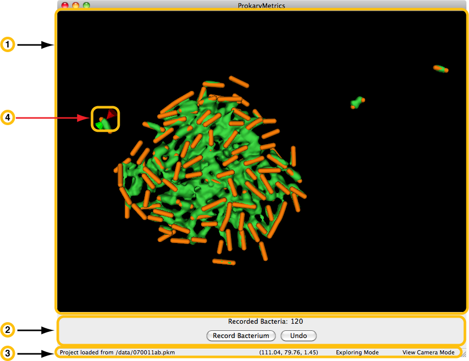

Introduction
============

ProkaryMetrics is a software package designed to provide:

- 3D reconstruction and visualization of 8/16-bit B&W fluorescent 
  microscopy z-stacks

- 3D interaction with the reconstructed data

- manually-assisted annotation of the individuals in microbial biofilms

- visual and quantitative analysis tools to gather quantitative 
  measurements on individuals as well as the biofilm as a whole
  
Software Requirements
---------------------
The software is written in Python (2.7) and requires the following 
libraries:

- VTK (the Visualization Toolkit). At least version 5.6.
- wxPython (windowing toolkit). At least version 2.8.10.
- PIL (the Python Imaging Library). At least version 1.1.7.

The simplest means to getting the appropriate Python environment with 
the appropriate libraries is to install the Enthought Python 
Distribution (free for Academic users) which can be found at:

`http://enthought.com/products/epd.php <http://enthought.com/products/epd.php>`_

ProkaryMetrics requires at least version 7.0 to run due to the need for 
Python 2.7.

In the near future, I hope to provide a self-contained app package for 
Mac/Win that will not require any installations.

Running ProkaryMetrics
----------------------
Once you have the appropriate Python environment and libraries installed, use 
a console to navigate to the ProkaryMetrics folder contained with this file in 
the downloaded archive and type::

    $> python pkMetrics.py

This command will launch the program, and everything else is done through 
interacting with the GUI.

User Interface
--------------
Below is a screenshot of the basic user interface for ProkaryMetrics. 
The major interface elements are highlighted, as well as the important 
data kept track of at all times.

1. **Visualization Window** - This is the main focus of ProkaryMetrics; 
   providing the user with 3D visualization of their reconstructed data, 
   and allowing mouse-interaction for 3D data manipulation and 
   exploration.
   
2. **Actions Panel** - This section of the program window provides 
   the count of bacteria the user has marked, and presents the 
   option to either save a set of marked points as a bacterium, or 
   undo the addition of the last recorded bacterium.
   
3. **Status Bar** - The status bar is divided into four sections. From 
   left to right: the most recent status message (seen here, the 
   successful loading of a saved project), the current mouse pointer 
   location in terms of X, Y, and Z within the rendered data, the 
   mouse click mode (Exploring allows the user to examine the data by 
   rotating, zooming, etc..., the other option Recording allows the 
   user to annotate bacteria), and the camera mode (this feature is 
   still in testing).
   
4. **Mouse Cursor** - The red and green cones represent the location of 
   the mouse, with the clicking tip between the points of the cones. 
   The two-cones cursor attaches itself to the nearest surface of the 
   reconstructed data, allowing the user to trace the surface and 
   thus permit accurate marking of bacteria. Here the cursor is 
   tracing the surface of a section of the image data (green) 
   representing a bacterium. The orange data is a user-recorded 
   marking of the bacterium from the image data.

Updating ProkaryMetrics
-----------------------
The latest version of the software is always available through the main 
website:

`http://www.justicelab.org/pkm <http://www.justicelab.org/pkm>`_

